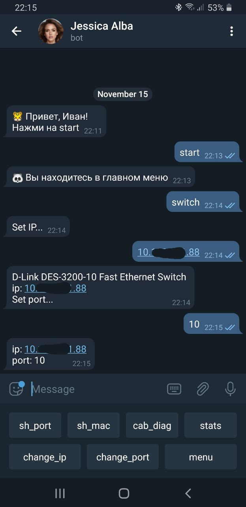
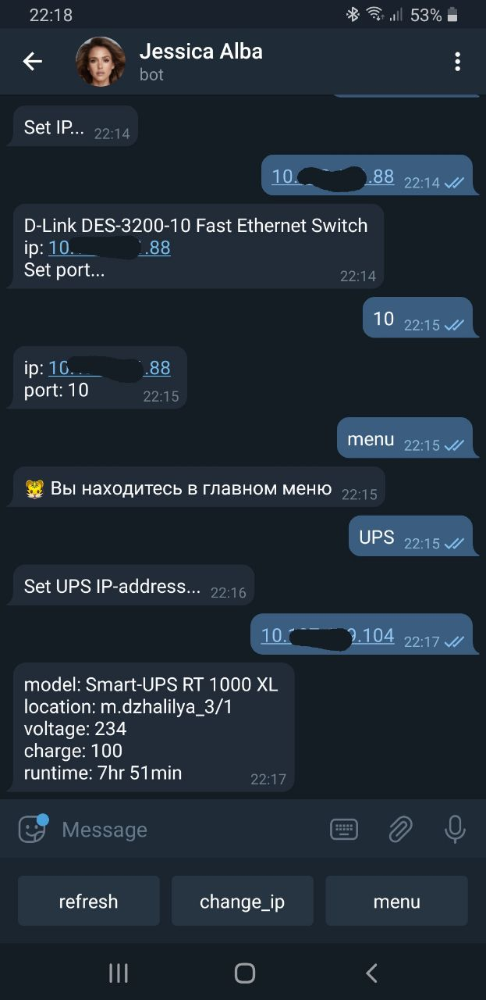
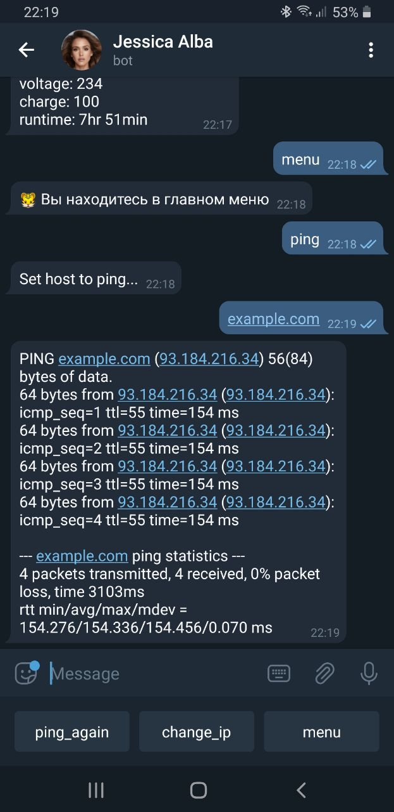

# network_bot
telegram bot for communication with network equipment

# settings.py example
```python
API_KEY = 'api_key'
SW_COMMUNITY = 'public'
UPS_COMMUNITY = 'public'
SNMP_PORT = 161
SWITCH_USERNAME = 'user_name'
SWITCH_PASSWORD = 'password'

USER_EMOJI = [':tiger:', ':chicken:']
USER_LIST = {'<tg_user_id>': 'John Conor',
             '<tg_user_id>': 'Thomas Anderson'			
            }
```

# usage
### to interact with switches
</img>
### to interact with UPS
</img>
### to ping!
</img>
